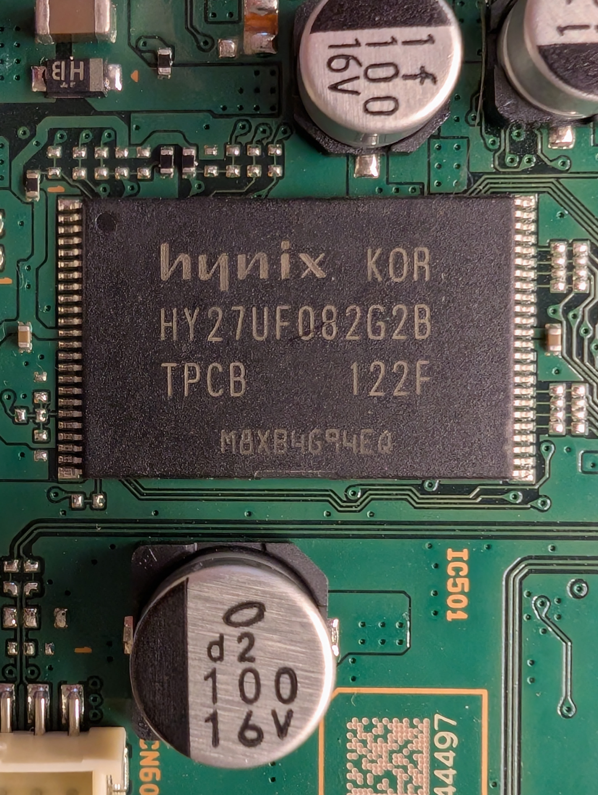

# SONY BLU-RAY DISC/DVD PLAYER BDP-S580

## Checklist

- [ ] Reference materials
    - [x] Manufacturer docs
    - [x] Firmware updates
    - [n/a] OpenWRT support
    - [n/a] Pinouts
- [ ] Factory reset
- [x] External documentation
- [x] Case opened
- [x] Internal documentation
- [ ] Dumped ROM .reset
- [ ] Extracted FW parts, inspected
- [ ] Factory reset with boot
- [ ] Dumped ROM regular
- [ ] Booted
- [ ] Root shell
- [ ] Pull stats
    - [ ] `uname -a`
    - [ ] `busybox --help`
    - [ ] `cat /proc/mtd`
- [ ] 

## Critical Info

```text
Serial no.: 
Input Voltage: XX VDC: XX A
```

## Reference material:

* [Manufacturer reference](https://www.sony.com/electronics/support/product/bdp-s580/manuals)
* [Firmware update](https://www.sony.com/electronics/support/product/bdp-s580/downloads)

## Inside

Phillips-head screws holding on a shell.
Pretty much the same pattern as the SONY DVP-NF575P.

### Boards

#### Mainboard

### Chips

#### Hynix HY27UF082G2B 2 GiB NAND Flash ROM



```text
TSOP-48 Type I
3.3V
```

[Datasheet](https://www.newark.com/hynix-semiconductor/hy27uf082g2b-tpcb/flash-memory-2gb-20ns-48-tsop/dp/15R1667)
This is the 8-bit (x8) version, referring to the IO width.

Interesting.
This chip has about the same package as the ROM in DVP-NF575P,
but a totally different pinout.

This may be my first time working with directly with NAND flash chips.
It looks like a reader is available at https://github.com/X360Tools/PicoFlasher.
I still don't have carrier boards though.

### Firmware

### Conclusion: ?
